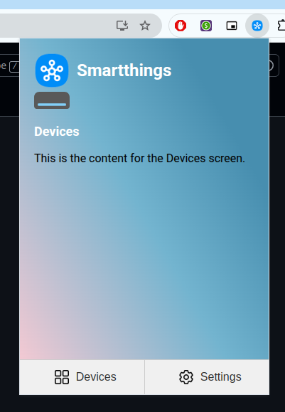
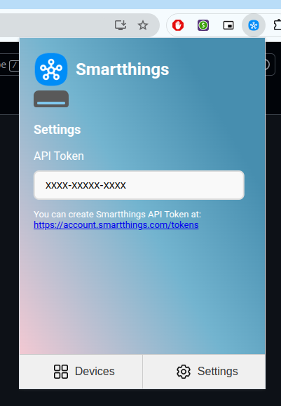

# Samsung SmartThings Chrome Extension (WIP)

Control Smasung Smartthings devices from a chrome extension.

Project inspiration: When working from home at my home office, I didn`t want to pick up my phone or AC controller to adjust the AC of the home office room.  
Much better to just open up a Chrome extension and control everything from there.

  
  

Next development steps:
- Listing devices in the Devices screen
- Clicking on a device and show settings for the device
- Controlling the device

Samsung Smartthings API Documentation [https://developer.smartthings.com/docs/api/public](https://developer.smartthings.com/docs/api/public)